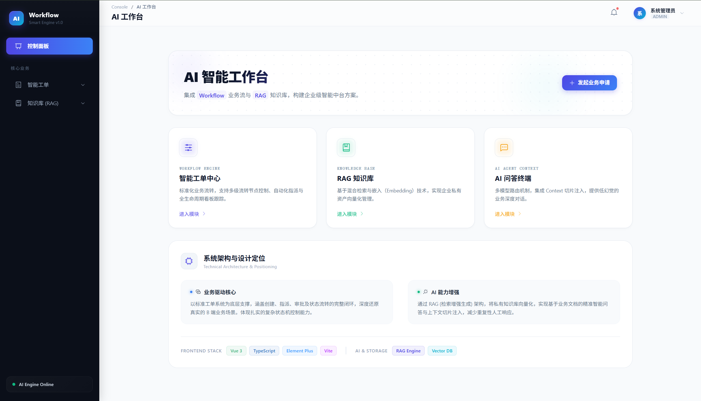
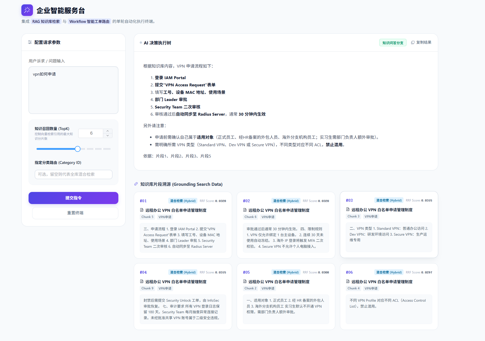
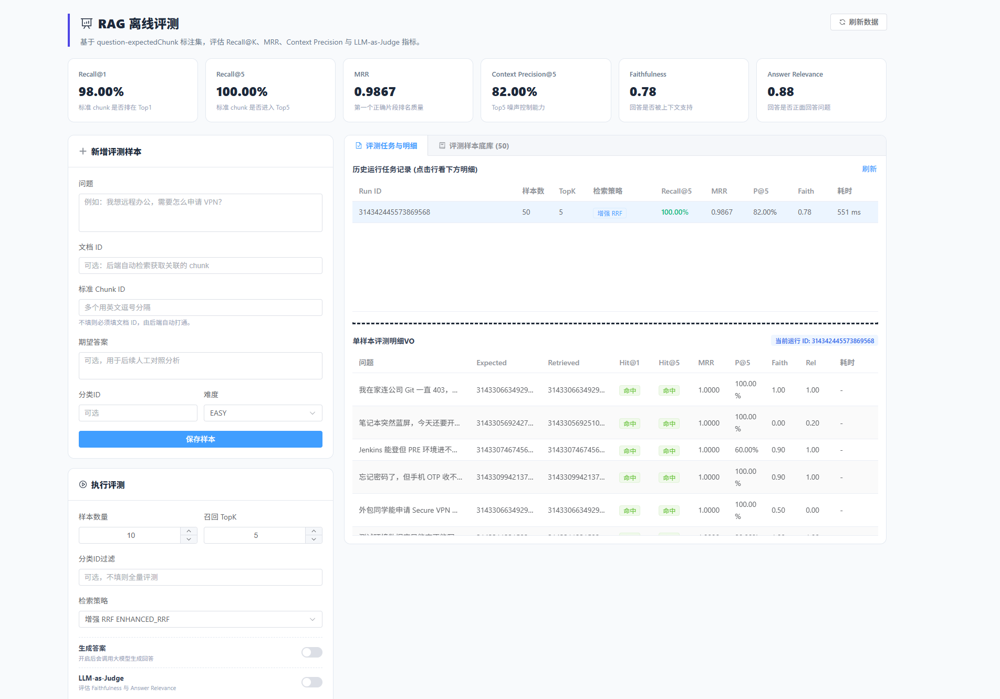
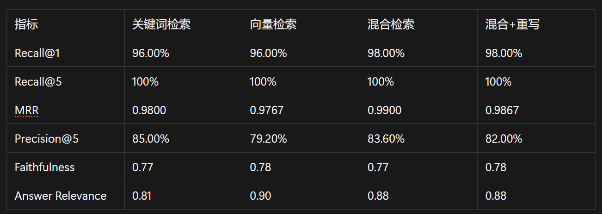
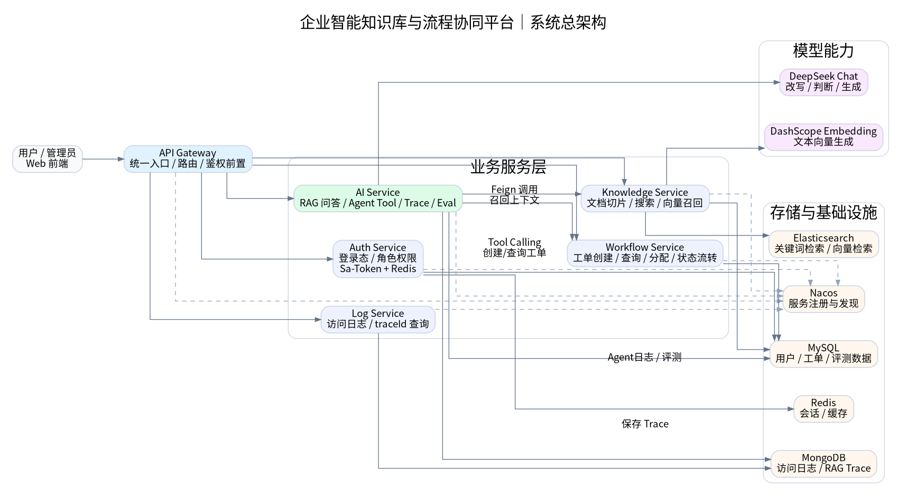
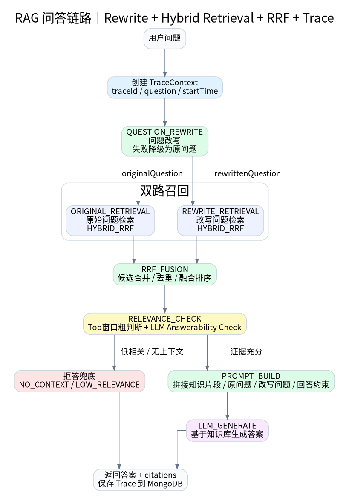
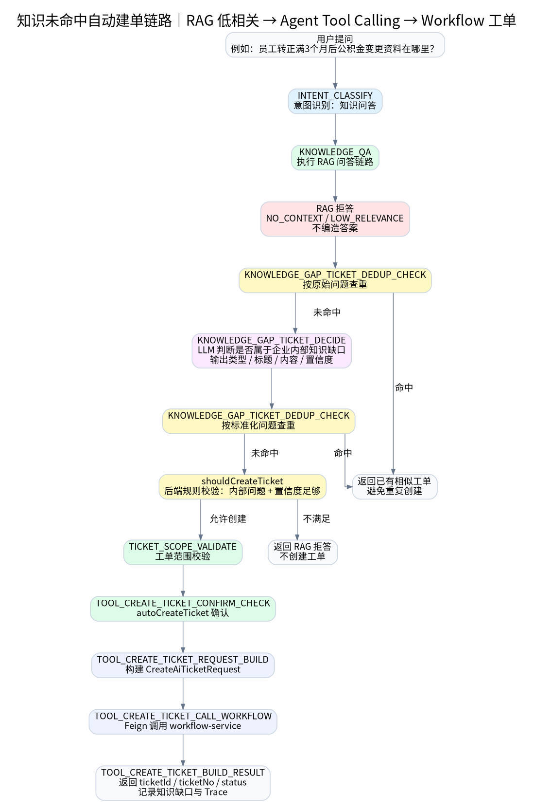
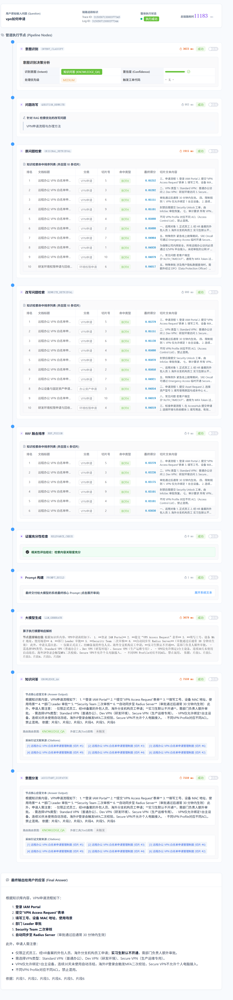
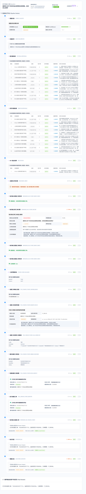
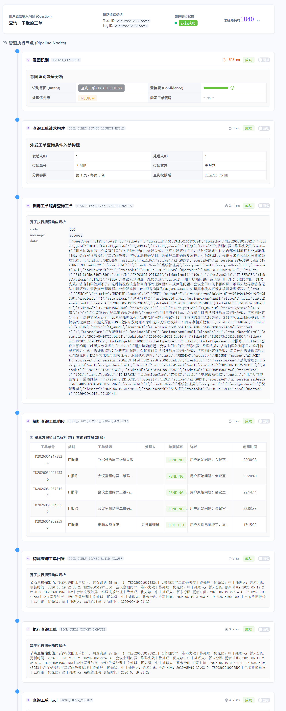

# 企业智能知识库与流程协同平台

> 一个面向企业 IT / 工单场景的 AI 应用工程项目，支持 RAG 问答、Agent Tool Calling、RAG Trace 可观测与 Benchmark 评测。

---

## 项目简介

本项目围绕企业内部知识检索与流程协同场景进行设计，目标是解决传统知识库“检索弱、不可观测、无法形成业务闭环”的问题。

系统支持：

* 企业知识库检索与 RAG 问答
* Hybrid Retrieval 混合检索
* Query Rewrite 与 RRF 融合排序
* RAG Trace 链路追踪与问题定位
* Agent Tool Calling
* 知识未命中自动创建工单
* RAG Benchmark 离线评测
* SSE 流式输出

项目整体采用 Spring Boot + Spring Cloud Alibaba 构建，服务拆分为认证、知识库、工单、AI、日志等模块。

---

# 核心能力

## 1. RAG 工程化

系统并非简单调用大模型 API，而是围绕企业知识库场景实现完整 RAG 流程：

* Query Rewrite
* Hybrid Retrieval
* RRF 融合排序
* Relevance Filter
* Prompt 构建
* Citation 引用返回
* SSE Streaming

支持：

* 关键词检索
* 向量检索
* 混合检索
* 文档切片召回
* chunk 引用返回

---

## 2. RAG Trace 可观测

实现 RAG 全链路 Trace 追踪，支持记录：

* Query Rewrite
* Retrieval
* Fusion
* Relevance Check
* Prompt Build
* LLM Generate
* Tool Calling

支持：

* Timeline 时间线分析
* Retrieval Diff
* 节点耗时统计
* Prompt 调试
* Answer 归因

用于定位：

* 错误召回
* 幻觉回答
* Prompt 问题
* Retrieval 不稳定
* Tool 调用失败

---

## 3. Agent Tool Calling

系统支持基于 Tool Calling 的流程协同能力：

* AI 创建工单
* AI 查询工单
* 用户身份绑定
* 工单状态查询

当知识库无法可靠回答问题时：

* 系统会进行低相关性判断
* 自动识别知识缺口
* 触发 Agent Tool Calling
* 自动创建工单
* 返回 ticketId
* 全流程写入 Trace

实现从“知识问答”到“流程协同”的闭环。

---

## 4. RAG Benchmark 评测

实现 RAG 离线评测模块，用于对不同检索策略进行效果分析。

支持对比：

* Keyword Search
* Vector Search
* Hybrid Search
* Hybrid + Rewrite

评测指标包括：

* Recall
* MRR
* Precision
* Faithfulness
* Answer Relevance

用于优化知识召回与回答稳定性。

---

# 系统架构

## 微服务模块

```text
enterprise-ai-platform
├── platform-gateway              # 网关
├── platform-auth-service         # 认证服务
├── platform-workflow-service     # 工单服务
├── platform-knowledge-service    # 知识库服务
├── platform-ai-service           # AI 服务
├── platform-log-service          # 日志服务
├── platform-api-contract         # Feign 契约
├── platform-common               # 公共模块
├── platform-common-starter       # 通用 starter
├── platform-satoken-starter      # Sa-Token starter
├── platform-redis-starter        # Redis starter
├── platform-id-starter           # Snowflake ID
└── platform-log-starter          # Trace / 日志 starter
```

---

## 技术架构

### 后端框架

* Java 17
* Spring Boot 3
* Spring Cloud Alibaba
* Spring Cloud Gateway
* OpenFeign
* MyBatis-Plus
* Sa-Token

### 中间件

* MySQL
* Redis
* Elasticsearch
* MongoDB
* Nacos
* Docker Compose

### AI / RAG

* LangChain4j
* DeepSeek
* DashScope Embedding
* Elasticsearch Vector Search
* Hybrid Retrieval
* Query Rewrite
* RRF
* SSE Streaming

---

# 项目展示

## 系统首页



---

## RAG 问答页面



---

## RAG Benchmark 评测页面



---

## Benchmark 评测结果

用于对不同 Retrieval Strategy 进行效果分析：

* Keyword Search
* Vector Search
* Hybrid Search
* Hybrid + Rewrite



---

# RAG 架构设计

## 系统架构图



---

## RAG Pipeline



---

## 知识缺口自动建单流程



---

# Trace 链路追踪

<details>
<summary>查看完整 Trace 长截图</summary>

## RAG 问答 Trace



---

## 创建工单 Trace



---

## 查询工单 Trace



</details>

---
# 项目亮点

## 工程化能力

* 微服务拆分
* 服务契约隔离
* starter 抽象
* Trace 可观测
* Benchmark 评测
* Docker Compose 本地编排

## AI 应用工程

* RAG 工程闭环
* Agent Workflow
* Tool Calling
* Prompt 调试
* Retrieval 优化
* 引用返回

## 稳定性与调优

* relevance filter
* 默认值兜底
* 参数校验
* Trace 节点耗时统计
* 压测与性能分析

---

# 本地启动

## 环境要求

* JDK 17+
* Maven 3.8+
* Docker / Docker Compose

---

## 启动基础设施

```bash
docker compose up -d
```

---

## 编译项目

```bash
mvn clean package -DskipTests
```

---

## 启动服务

建议按以下顺序启动：

```text
1. platform-gateway
2. platform-auth-service
3. platform-workflow-service
4. platform-knowledge-service
5. platform-ai-service
6. platform-log-service
```

---

# 核心接口

## RAG 问答

```http
POST /ai/rag/chat
```

## SSE 流式问答

```http
POST /ai/rag/chat/stream
```

## Agent 对话

```http
POST /ai/assistant/chat
```

## 创建工单

```http
POST /workflow/tickets
```

---

# 项目定位

该项目重点关注：

* AI 应用工程
* RAG 工程化
* 企业知识库
* Agent Workflow
* 系统可观测
* 工程闭环

而非模型训练或 AI Infra。

---

# 后续规划

* Rerank 模型接入
* MCP Tool Registry
* 多 Agent Workflow
* Prompt Version 管理
* 在线评测体系
* Retrieval Replay
* Trace Diff
