# 系统架构设计文档

> 项目名称：企业智能知识库与流程协同平台  
> 当前定位：轻量级微服务后端项目，围绕认证鉴权、工单流转、知识库检索、RAG 问答、智能助手和访问日志形成最小可演示闭环。

---

## 1. 架构目标

本项目采用多模块微服务架构，目标不是单纯堆叠中间件，而是在保证本地可启动、可演示、可维护的前提下，实现以下能力：

1. 用户登录、角色鉴权和登录态共享。
2. 员工侧工单创建、查询；处理侧接单、分配、处理。
3. 知识文档维护、文档切片、全文检索、向量检索和混合检索。
4. 基于知识库的 RAG 问答和 SSE 流式输出。
5. 智能助手根据用户问题分发到知识问答、工单创建、工单查询等能力。
6. 基于 AOP 的接口访问日志采集、脱敏、traceId 追踪和 MongoDB 存储。
7. 通过 Docker Compose 提供基础设施，降低本地部署成本。

---

## 2. 系统整体架构

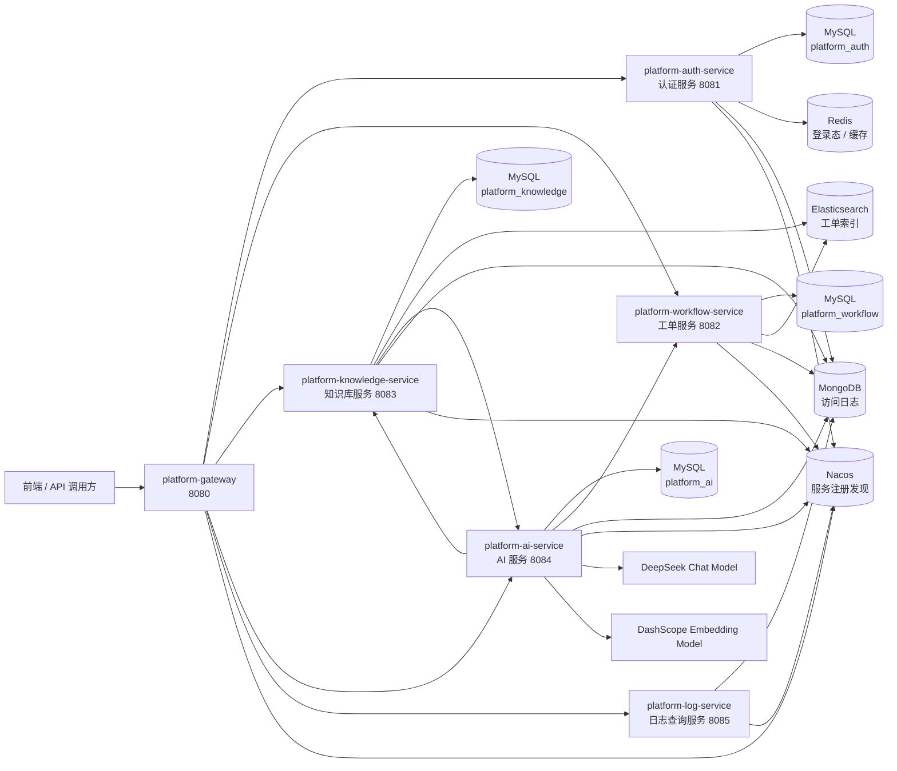

说明：

- `platform-gateway` 负责统一入口和路由转发。
- `platform-auth-service` 负责登录、登出、当前用户信息。
- `platform-workflow-service` 负责工单主流程。
- `platform-knowledge-service` 负责知识文档、切片、检索和 RAG 上下文召回。
- `platform-ai-service` 负责 RAG 问答、智能助手、embedding 生成和 AI 调用编排。
- `platform-log-service` 负责访问日志查询，不负责采集；采集由 `platform-log-starter` 完成。
- Elasticsearch 在当前版本作为搜索副本，不作为主业务数据源。
- RabbitMQ、MinIO、Jaeger 当前作为后续扩展组件预留，不属于当前核心链路强依赖。

---

## 3. 模块关系图

```mermaid
flowchart TB
    Root["platform"] --> Common["platform-common<br/>通用返回、异常、工具类"]
    Root --> CommonStarter["platform-common-starter<br/>全局异常、Jackson、内部接口拦截"]
    Root --> SaTokenStarter["platform-satoken-starter<br/>登录鉴权自动配置"]
    Root --> RedisStarter["platform-redis-starter<br/>RedisTemplate / 健康检查"]
    Root --> LogStarter["platform-log-starter<br/>访问日志 AOP"]
    Root --> IdStarter["platform-id-starter<br/>雪花 ID"]
    Root --> ApiContract["platform-api-contract<br/>服务间 Feign 契约"]

    Root --> Gateway["platform-gateway"]
    Root --> Auth["platform-auth-service"]
    Root --> Workflow["platform-workflow-service"]
    Root --> Knowledge["platform-knowledge-service"]
    Root --> AI["platform-ai-service"]
    Root --> LogService["platform-log-service"]

    Auth --> Common
    Auth --> CommonStarter
    Auth --> SaTokenStarter
    Auth --> RedisStarter
    Auth --> LogStarter

    Workflow --> Common
    Workflow --> CommonStarter
    Workflow --> SaTokenStarter
    Workflow --> LogStarter
    Workflow --> IdStarter
    Workflow --> ApiContract

    Knowledge --> Common
    Knowledge --> CommonStarter
    Knowledge --> SaTokenStarter
    Knowledge --> LogStarter
    Knowledge --> ApiContract

    AI --> Common
    AI --> CommonStarter
    AI --> SaTokenStarter
    AI --> LogStarter
    AI --> ApiContract

    LogService --> Common
    LogService --> CommonStarter
    LogService --> SaTokenStarter
```

模块分层原则：

| 层级 | 模块 | 职责 |
| --- | --- | --- |
| 基础能力层 | `platform-common` | 统一响应、异常码、断言、工具类 |
| 自动配置层 | `*-starter` | Redis、Sa-Token、日志、ID、公共配置等复用能力 |
| 契约层 | `platform-api-contract` | 服务间 Feign Client 和 DTO 契约 |
| 网关层 | `platform-gateway` | 外部统一入口、路由转发 |
| 业务服务层 | `auth / workflow / knowledge / ai / log` | 各业务域独立服务 |
| 基础设施层 | MySQL、Redis、MongoDB、Elasticsearch、Nacos | 数据、缓存、日志、检索、注册发现 |

---

## 4. 网关路由架构

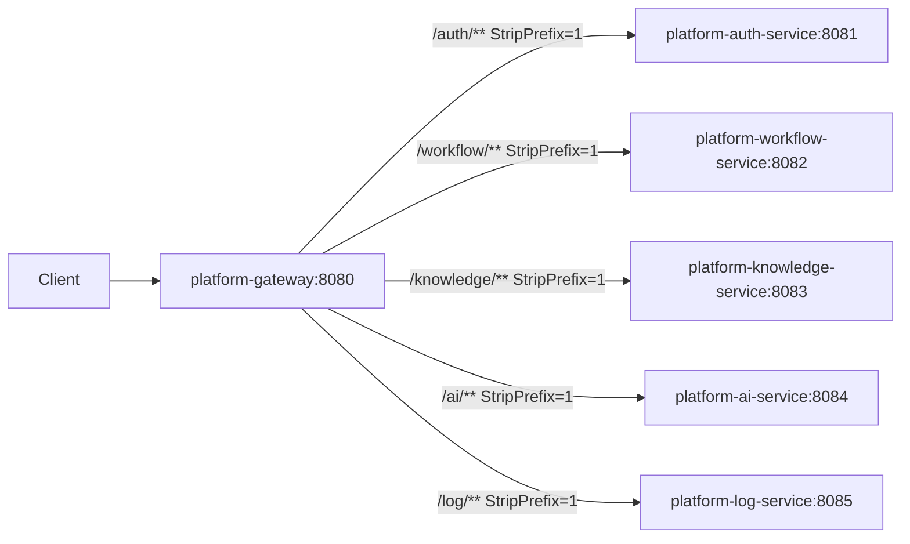

示例：

| 外部路径 | 网关转发后路径 | 目标服务 |
| --- | --- | --- |
| `POST /auth/login` | `POST /login` | `platform-auth-service` |
| `POST /workflow/tickets` | `POST /tickets` | `platform-workflow-service` |
| `POST /knowledge/documents` | `POST /documents` | `platform-knowledge-service` |
| `POST /ai/assistant/chat` | `POST /assistant/chat` | `platform-ai-service` |
| `GET /log/access-logs` | `GET /access-logs` | `platform-log-service` |

---

## 5. 认证鉴权架构

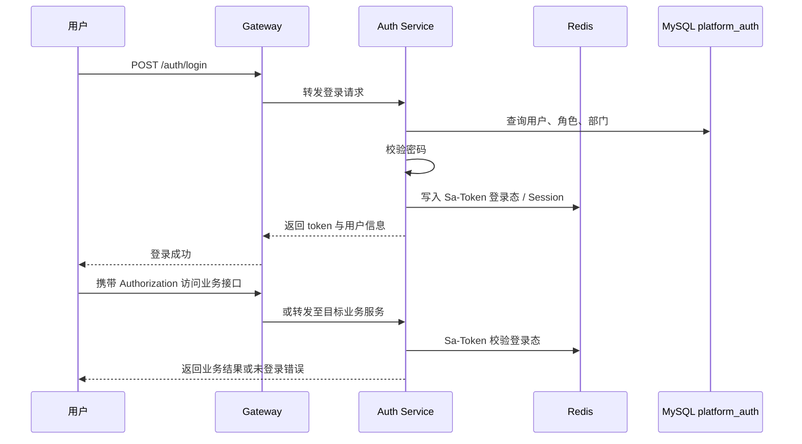

当前鉴权特点：

1. Token 名称为 `Authorization`。
2. 使用 Sa-Token 管理登录态。
3. 使用 Redis 支撑分布式登录态共享。
4. 业务接口通过 `@SaCheckLogin` 判断是否登录。
5. 管理员、客服、普通员工等角色通过 `@SaCheckRole` 控制接口访问。
6. Service 层部分关键方法保留权限兜底校验，避免后续内部复用时绕过 Controller 权限注解。

角色模型：

| 角色 | 说明 | 典型权限 |
| --- | --- | --- |
| `ADMIN` | 管理员 | 工单分配、日志查询、知识库维护、处理侧全量工单 |
| `SUPPORT` | 客服 / 处理人员 | 接单、处理工单、知识检索、知识维护 |
| `EMPLOYEE` | 普通员工 | 创建工单、查看自己的工单、使用智能助手 |

---

## 6. 工单业务架构

### 6.1 工单核心流程

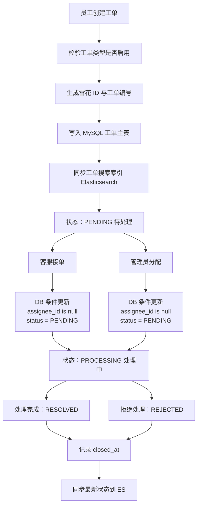

### 6.2 工单状态流转

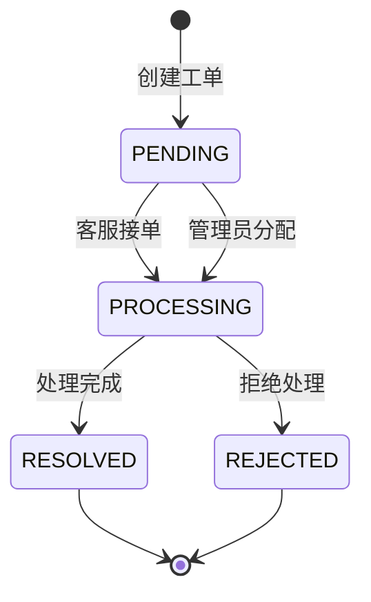

当前状态说明：

| 状态 | 含义 | 说明 |
| --- | --- | --- |
| `PENDING` | 待处理 | 新建工单默认状态，尚未分派处理人 |
| `PROCESSING` | 处理中 | 已被客服接单或管理员分配 |
| `RESOLVED` | 已解决 | 处理人已完成处理 |
| `REJECTED` | 已拒绝 | 处理人拒绝处理或无法处理 |

### 6.3 并发接单设计

工单接单不是通过“先查再改”保证并发安全，而是通过数据库原子条件更新实现：

```sql
UPDATE wf_ticket
SET assignee_id = ?,
    assignee_name = ?,
    status = 'PROCESSING',
    updated_at = NOW()
WHERE id = ?
  AND assignee_id IS NULL
  AND status = 'PENDING';
```

设计效果：

1. 多个客服同时接单时，只有第一个成功更新的请求影响行数为 1。
2. 后续请求影响行数为 0，业务层返回“工单已被接走或状态已变化”。
3. 不需要在当前版本引入分布式锁，复杂度更低。
4. 面试讲解时可以重点强调“数据库条件更新保证并发安全”。

### 6.4 工单数据读写关系

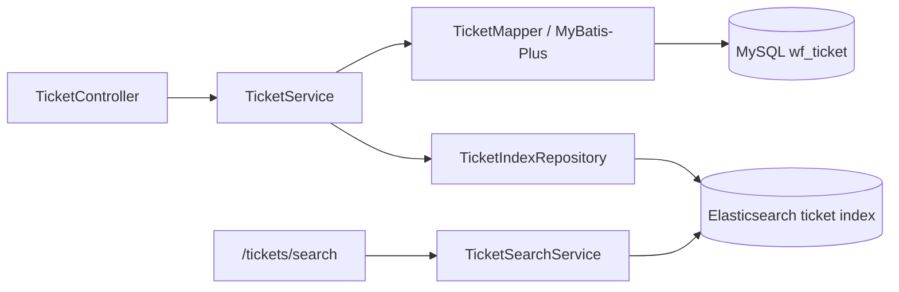

说明：

- MySQL 是工单主数据源。
- Elasticsearch 是搜索副本，用于处理侧搜索。
- 当前 ES 同步失败只记录日志，不中断主业务流程。
- 后续可以演进为“搜索同步任务表 + 定时补偿”，不一定必须引入 MQ。

---

## 7. 知识库架构

### 7.1 知识文档处理流程

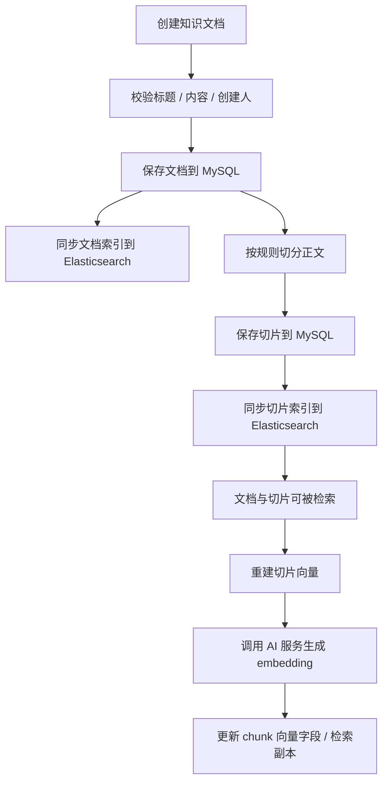

### 7.2 知识库数据模型关系

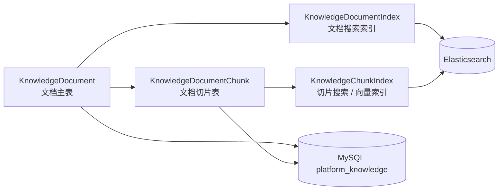

说明：

- 文档主表保存标题、分类、正文、状态等主数据。
- 切片表保存文档拆分后的 chunk，可追踪、可重建。
- ES 文档索引用于文档级搜索。
- ES 切片索引用于 chunk 级全文检索、向量检索和混合检索。

---

## 8. 知识库检索架构

### 8.1 全文检索、向量检索和混合检索

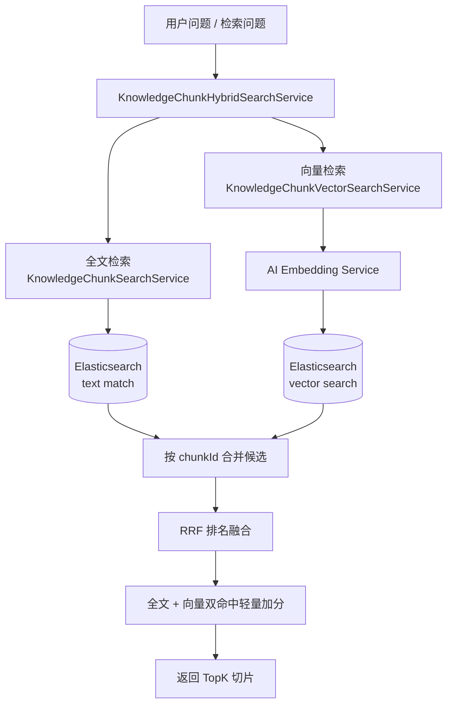

### 8.2 RRF 融合策略

当前混合检索采用 RRF（Reciprocal Rank Fusion）策略：

```text
score = 1 / (k + rank)
```

当前设计要点：

1. 全文检索和向量检索分别召回候选结果。
2. 按 `chunkId` 合并同一个切片。
3. 根据两路结果中的排名计算 RRF 分数。
4. 同时被全文和向量召回的切片增加轻量 bonus。
5. 最终按融合分数倒序返回 TopK。

这种方案适合当前项目阶段：实现成本低、可解释性强、面试时容易讲清楚。

---

## 9. RAG 问答架构

### 9.1 普通 RAG 问答流程

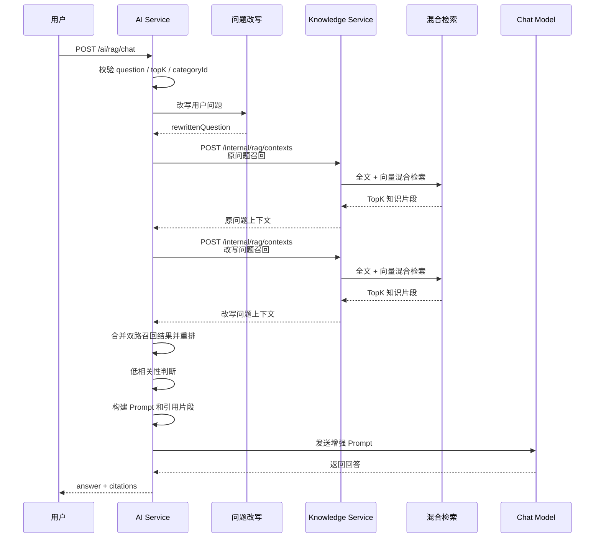

### 9.2 SSE 流式 RAG 问答流程

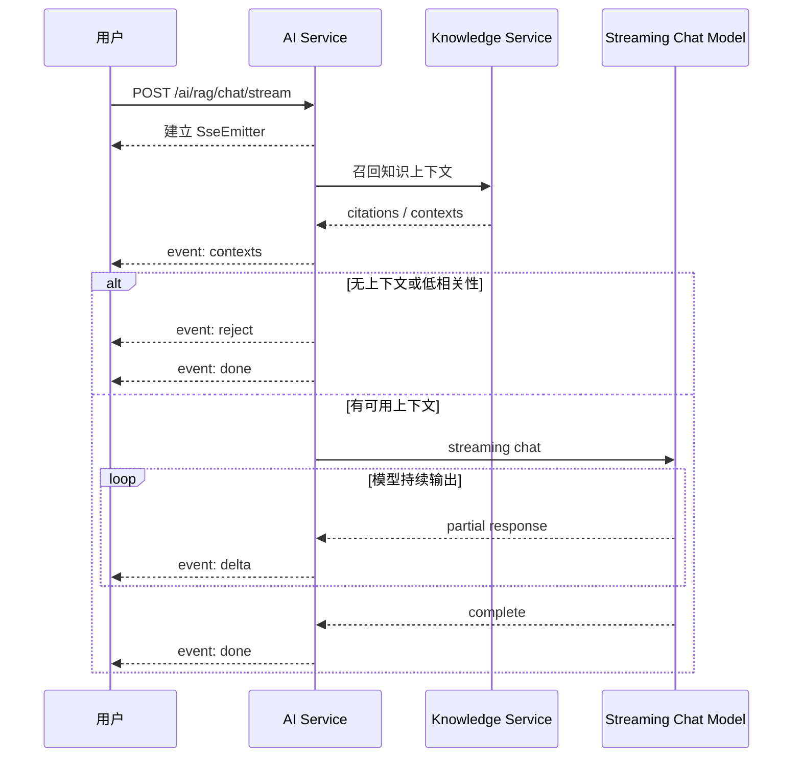

### 9.3 RAG Prompt 约束

当前 Prompt 设计强调：

1. 严格基于知识库内容回答。
2. 知识库不足时明确说明无法确定，不编造。
3. 回答要标注依据片段编号。
4. 改写问题只用于辅助召回，不改变用户原始意图。
5. 多个片段相关时综合回答，避免只取一个片段。

---

## 10. 智能助手架构

智能助手是 AI 服务上的更高一层编排能力，不只做知识问答，还可以识别用户意图并调用工单工具。

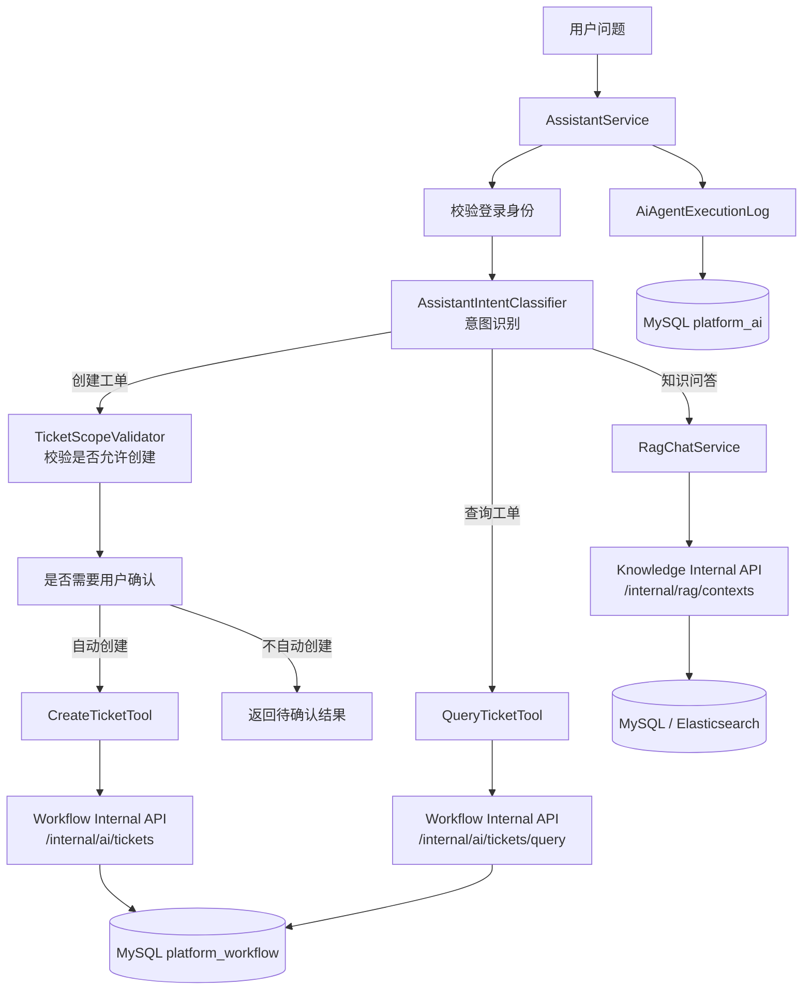

智能助手当前支持的意图：

| 意图 | 处理方式 |
| --- | --- |
| 知识问答 | 调用 `RagChatService` |
| 创建工单 | 校验范围后调用 `CreateTicketTool` |
| 查询工单 | 调用 `QueryTicketTool` |

设计亮点：

1. Assistant 主流程只负责编排，不把所有逻辑堆在 Controller。
2. 意图识别、范围校验、工单创建、工单查询、日志组装拆分为独立组件。
3. AI 创建工单走 Workflow 内部接口，避免前端直接伪造 AI 来源。
4. AI 执行过程落库，方便排查意图识别、工具调用和失败原因。

---

## 11. 访问日志架构

### 11.1 访问日志采集流程

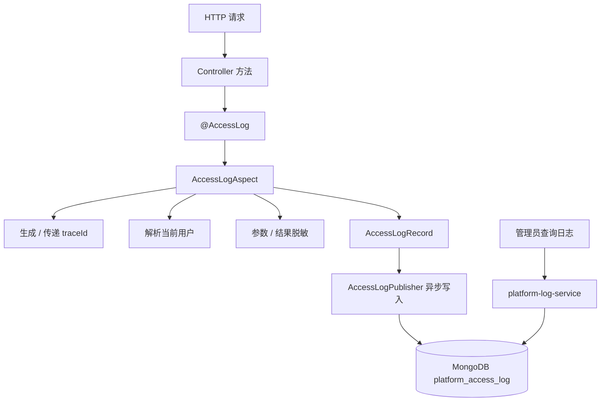

### 11.2 日志设计说明

| 能力 | 说明 |
| --- | --- |
| AOP 采集 | 通过 `@AccessLog` 注解记录接口访问 |
| traceId | 用于串联一次请求中的日志记录 |
| 脱敏 | 避免密码、token 等敏感字段进入日志 |
| 异步写入 | 降低日志写入对主流程的影响 |
| MongoDB 存储 | 适合保存结构灵活的访问日志 |
| 管理员查询 | 通过日志服务分页查询或按 traceId 查询 |

---

## 12. 内部接口架构

服务间调用通过 `platform-api-contract` 中的 Feign Client 契约完成。

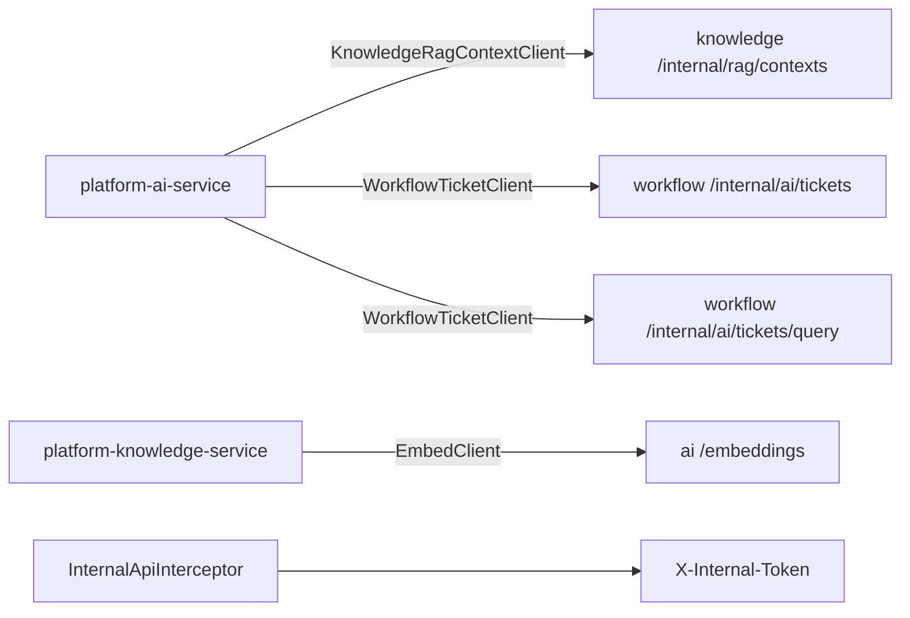

当前内部接口说明：

| 调用方 | 被调用方 | 用途 |
| --- | --- | --- |
| AI 服务 | Knowledge 服务 | RAG 上下文召回 |
| Knowledge 服务 | AI 服务 | 批量生成 embedding |
| AI 服务 | Workflow 服务 | AI 创建工单 |
| AI 服务 | Workflow 服务 | AI 查询工单 |

后续建议：

1. `/internal/**` 统一禁止从网关外部访问。
2. `platform.internal.token` 改为环境变量。
3. embedding 接口建议迁移为内部路径，例如 `/internal/embeddings`。
4. 服务间调用增加超时、重试、熔断和降级策略。

---

## 13. 数据存储架构

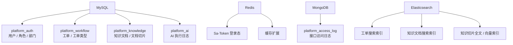

数据源职责划分：

| 存储 | 职责 | 是否主数据源 |
| --- | --- | --- |
| MySQL | 业务主数据，例如用户、工单、知识文档、AI 执行日志 | 是 |
| Redis | 登录态、缓存、分布式会话 | 否 |
| MongoDB | 访问日志 | 是，针对日志域 |
| Elasticsearch | 搜索副本、全文检索、向量检索 | 否 |

---

## 14. 本地部署拓扑

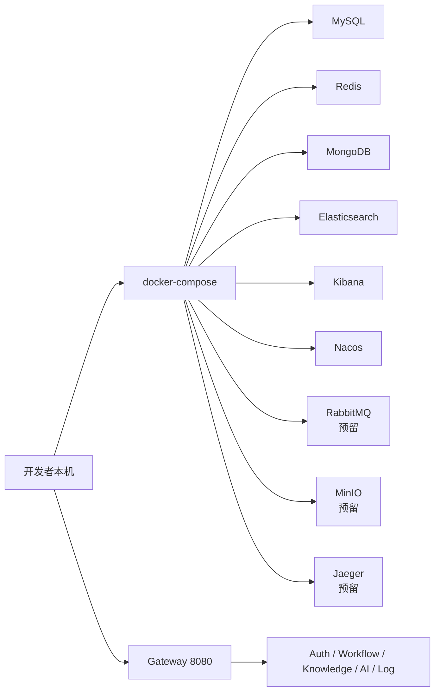

当前推荐启动顺序：

1. 启动 Docker Compose 基础设施。
2. 启动 `platform-gateway`。
3. 启动 `platform-auth-service`。
4. 启动 `platform-workflow-service`。
5. 启动 `platform-knowledge-service`。
6. 启动 `platform-ai-service`。
7. 启动 `platform-log-service`。

---

## 15. 当前架构取舍

### 15.1 为什么当前阶段不强制引入 MQ

当前项目强调轻量化和快速演示，核心业务链路可以通过同步写库、状态字段、条件更新和后续补偿任务完成闭环。如果现在过早引入 MQ，会额外带来：

1. 消息发送失败处理。
2. 消息重复消费和幂等设计。
3. 死信队列与重试策略。
4. 消息积压监控。
5. 消费者扩缩容和异常恢复。
6. 本地部署复杂度提升。

因此，当前版本建议优先使用：

```text
数据库状态表 + 定时补偿任务
```

来解决文档处理、ES 同步、embedding 重建等异步和失败重试问题。

后续当文档处理量、embedding 调用量或通知任务明显增加时，再将任务状态表平滑演进为 MQ 消费模型。

### 15.2 当前适合异步化的地方

| 场景 | 当前方式 | 推荐下一步 |
| --- | --- | --- |
| 工单同步 ES | 同步尝试，失败记录日志 | 搜索同步任务表 + 定时补偿 |
| 知识文档同步 ES | 同步尝试，失败记录日志 | 文档索引任务表 + 定时补偿 |
| 文档切片 embedding | 手动触发 / 服务调用 | 任务状态表 + 重试次数 |
| 访问日志写入 | starter 内异步写入 MongoDB | 保持现状 |
| AI 创建工单 | 同步调用 Workflow 内部接口 | 保持同步，确保用户能立即拿到结果 |

---

## 16. 后续架构演进方向

### 16.1 第一阶段：轻量补强

优先级最高，适合当前简历项目阶段：

1. 补充 README、接口文档和架构文档。
2. 清理 `.idea`、`target`、`.iml`、`.class` 等无关文件。
3. 将内部 token、数据库密码、模型 key 改为环境变量。
4. 网关禁止外部访问 `/internal/**`。
5. RAG 问答接口补登录校验和限流。
6. embedding 接口改成内部接口。
7. 补充核心单元测试和 Service 测试。

### 16.2 第二阶段：业务能力增强

建议重点增强工单和知识库闭环：

1. 工单操作历史表。
2. 工单评论。
3. 工单附件，结合 MinIO。
4. 工单 SLA 超时字段与定时扫描。
5. 文档处理任务状态表。
6. ES 同步补偿任务。
7. embedding 生成失败重试。
8. RAG 回答引用来源增强。

### 16.3 第三阶段：可观测与可靠性增强

当项目基础功能稳定后再做：

1. 接入链路追踪。
2. Feign 调用超时、重试、熔断和降级。
3. 统一限流策略。
4. 接入 Prometheus / Grafana。
5. 引入 MQ 处理文档构建、通知、索引同步等异步任务。

---

## 17. 面试讲解建议

面试时可以按这条主线介绍项目：

```text
这个项目是一个企业内部智能知识库与流程协同平台。
我采用微服务拆分，把认证、工单、知识库、AI 助手、日志查询拆成独立服务，
通过网关统一入口，通过 Nacos 做服务发现，通过 Sa-Token + Redis 做登录态共享。

业务上，工单模块支持员工创建、客服接单、管理员分配和状态流转。
接单并发不是用分布式锁，而是通过数据库条件更新保证只有一个处理人能接单成功。

知识库模块支持文档创建、切片、全文检索、向量检索和 RRF 混合召回。
AI 服务基于召回结果构建 Prompt，并要求模型严格基于知识库回答，同时返回引用片段。

另外我封装了访问日志 starter，通过 AOP 自动记录接口日志、traceId 和脱敏信息，
日志异步写入 MongoDB，再由日志服务提供查询能力。

架构取舍上，我当前没有强行引入 MQ，因为项目定位是轻量化演示。
对于 ES 同步、文档处理、embedding 生成这类耗时或可能失败的任务，
后续会优先采用任务状态表 + 定时补偿，等任务量上来后再演进到 MQ。
```

---

## 18. 架构亮点总结

1. **微服务分层清晰**：网关、认证、工单、知识库、AI、日志职责明确。
2. **公共能力复用**：通过 starter 封装 Sa-Token、Redis、日志、ID 等基础能力。
3. **并发接单设计合理**：使用数据库条件更新保证并发安全，避免过早引入分布式锁。
4. **RAG 链路完整**：问题改写、双路召回、RRF 融合、相关性判断、Prompt 约束、引用来源基本闭环。
5. **日志体系有工程化意识**：AOP 采集、脱敏、traceId、异步写入、MongoDB 查询。
6. **架构取舍克制**：没有为了简历强行上 MQ，而是优先保证轻量、可部署、可解释。
7. **具备演进空间**：后续可以自然扩展任务状态表、补偿任务、MQ、MinIO、链路追踪和监控体系。
